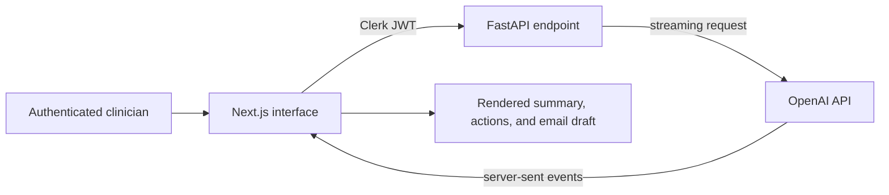

# MediNotes Pro — AI Consultation-Notes Prototype

An end-to-end SaaS prototype that turns clinician-written consultation notes into a structured visit summary, suggested follow-up actions, and a patient-friendly email draft.

The project demonstrates how an LLM can be embedded inside an authenticated operational workflow rather than exposed as a standalone chat box.

## Architecture



## Engineering highlights

- Next.js and TypeScript frontend with Clerk sign-in, user state, and subscription-plan gating.
- FastAPI endpoint protected by Clerk's JWKS-backed bearer-token verification.
- Typed Pydantic request body for patient, visit date, and consultation notes.
- Streaming model output over server-sent events for responsive rendering.
- Markdown rendering for the generated record summary, next steps, and communication draft.

## Run locally

From the `saas/` directory:

```bash
npm install
npm run dev
```

Copy `saas/.env.example` to `saas/.env.local` and replace every placeholder. The frontend requires Clerk configuration; the Python endpoint requires `CLERK_JWKS_URL`, an OpenAI API key, and the packages in `saas/requirements.txt`.

## Safety and scope

**Prototype only. Do not enter real patient information.** This repository is not configured or certified for clinical use, HIPAA compliance, medical diagnosis, or autonomous patient communication. Data sent to the endpoint is forwarded to an external model provider. Any generated summary, next step, or email must be reviewed and approved by a qualified clinician.

Before real deployment, the system would need formal privacy/security review, appropriate vendor agreements, data-retention controls, audit logging, redaction, model evaluation, abuse testing, and organisation-specific clinical governance.

